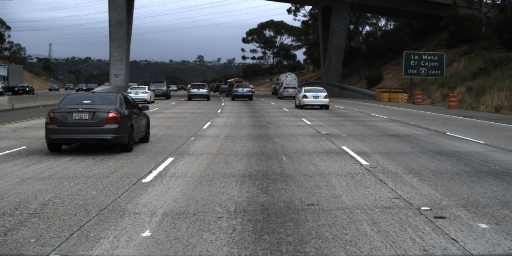
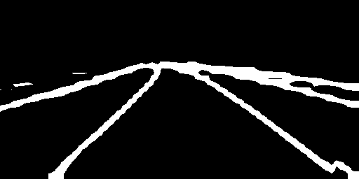
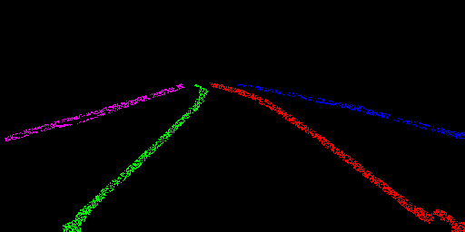

# LaneNet Postprocessing

This repository contains the postprocessing pipeline for refining and interpreting lane detection results obtained from the LaneNet model. The LaneNet model generates binary and instance outputs, representing lane presence and lane instance embeddings, respectively. The postprocessing steps aim to enhance the lane detection results and extract meaningful lane instances. This project was based of https://github.com/MaybeShewill-CV/lanenet-lane-detection and https://github.com/MaybeShewill-CV/MNN-LaneNet.

## Postprocessing Steps

1. **Loading Binary and Instance Outputs:** Load the binary and instance outputs obtained from the LaneNet model. The binary output represents pixel-wise lane presence, while the instance output contains pixel embedding features. They are found in /100_test/model_output/.

2. **Gather Pixel Embedding Features:** Extract pixel embedding features from the instance output for pixels corresponding to detected lanes. Collect the embedding vectors associated with pixels labeled as lanes.

3. **Cluster Pixel Embedding Features:** Utilize the DBSCAN algorithm to group pixels with similar embedding features into clusters. DBSCAN identifies dense regions of data points and discards noise points.

4. **Normalization of Sample Features:** Normalize the embedding feature vectors within each cluster. Apply normalization techniques such as z-score or min-max scaling to ensure fair feature comparison.

5. **Calculating Mean and Standard Deviation:** Calculate the mean and standard deviation of normalized embedding feature vectors within each cluster. The mean represents a characteristic feature profile, while the standard deviation indicates variability.

## Optimization and Potential Improvements

- **Thresholding:** Experiment with binary output thresholding to balance precision and recall in lane detection.

- **DBSCAN Parameters:** Tune DBSCAN hyperparameters (epsilon, minimum points) for optimal clustering results based on lane characteristics.

- **Feature Normalization:** Select a normalization technique that preserves data structure during clustering.

- **Clustering Quality:** Assess clustering quality with metrics like silhouette score. Adjust parameters for better separation.

- **Efficiency:** Utilize optimized DBSCAN implementations with spatial indexing for large datasets.

- **Edge Cases:** Handle occlusions and lane crossings with preprocessing or post-processing strategies.

## Usage

1. Clone the repository:
   ```bash
   git clone https://github.com/patrickeala/lanenet-postprocess.git
   cd lanenet-postprocess

2. Build the project using CMake:
   ```bash
   mkdir build
   cd build
   cmake ..
   make

3. Compile and run the program:
   ```bash
   ./main PATH_TO_NPY_DIR IMG_INDEX
   
   ./main ../100_test/model_output/ 1
   
The program will generate binary and instance segmentation images in the specified input directory.


## Example Results

### Input Image


### Binary Segmentation


### Instance Segmentation

